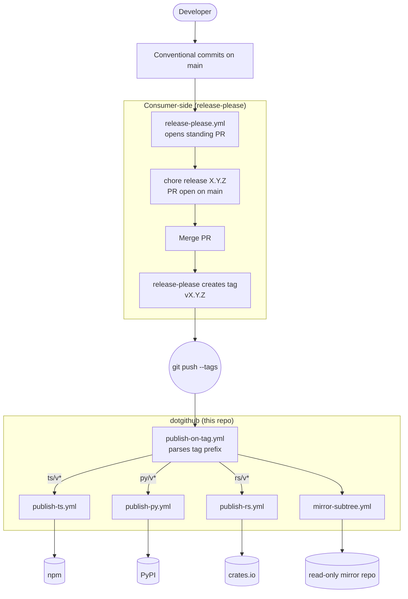

# hop-top/.github

Org-default repo for [hop-top](https://github.com/hop-top). Hosts the
**publish/mirror layer** of the release pipeline: the workflows that
run *after* release-please cuts a tag.

## What this is, and is not

**This repo is**:

- Reusable GitHub Actions workflows that publish to npm / PyPI /
  crates.io and push subtree splits to read-only mirror repos
- Triggered by `<component>/v<version>` tag pushes
- PR-time spec-versioning gates for repos with a spec tree —
  per-version commit rules, channel-derived `**Status:**` lines on
  release PRs, a guard over release-version literals and
  `<root>/vX.Y` paths (`spec-commit-rules`, `spec-status-line`,
  `version-check`; see
  [`references/how-to/spec-versioning.md`](references/how-to/spec-versioning.md))
- Org-level community files (CODE_OF_CONDUCT, SECURITY, CONTRIBUTING,
  issue forms, PR template)
- Profile rendered at <https://github.com/hop-top>

**This repo is not**:

- A version manager — release-please does that
- A changelog generator — release-please does that
- A release-PR opener — release-please does that
- A replacement for release-please

The split: **release-please owns "from commit to tag"; dotgithub
owns "from tag to published package"**. They compose; you need both.

## I want to USE these workflows in my repo

See [`SKILL.md`](SKILL.md) — quick-start, secrets reference, common
pitfalls.

## I want to MODIFY these workflows

See [`DEVELOPING.md`](DEVELOPING.md) — local setup, authoring rules,
how to add a new ecosystem, how this repo self-releases.

## The pipeline at a glance



See [`docs/architecture.md`](docs/architecture.md) for full diagrams
(router dispatch, secret flow).

## Layout

```
.github/
  workflows/
    publish-on-tag.yml       reusable: router (parses tag → dispatches)
    publish-ts.yml           reusable: npm publish
    publish-py.yml           reusable: PyPI publish (OIDC)
    publish-rs.yml           reusable: crates.io publish
    mirror-subtree.yml       reusable: subtree split + mirror push
    spec-commit-rules.yml    reusable: per-spec-version commit isolation (PRs)
    spec-status-line.yml     reusable: channel-derived status lines (release PRs)
    version-check.yml        reusable: release-version literal + spec-path guard
    release-please-preflight.yml  reusable: config-shape checks at PR time
    ci.yml                   self-CI: actionlint + script tests
    release-please.yml       self-release: opens release PRs
  release-please-config.json self-release config
  .release-please-manifest.json
ISSUE_TEMPLATE/              org-default issue forms (bug, feature)
PULL_REQUEST_TEMPLATE.md     org-default PR template
docs/
  architecture.md            full pipeline diagrams + design rationale
  diagrams/                  Mermaid sources (also embedded inline in docs)
profile/
  README.md                  org-page content
scripts/
  spec/                      Python behind the spec-versioning workflows (+ tests)
SKILL.md                     consumer-facing how-to
DEVELOPING.md                collaborator-facing how-to
VERSION                      current release-please-managed version
```

## Versioning

This repo is itself released via release-please. Plain semver tags:
`v0.1.0`, `v0.1.1`, `v0.2.0`, ..., `v1.0.0`. Plus rolling major
tags (`v0`, `v1`, ...) auto-maintained by
[`roll-major-tag.yml`](.github/workflows/roll-major-tag.yml).

Consuming repos pin to a rolling major (recommended):

```yaml
uses: hop-top/.github/.github/workflows/publish-on-tag.yml@v0
```

Auto-updates on each non-breaking release. Pin `@v0.1.0` to freeze
exactly, `@main` to follow everything (breaking changes welcome).

See [`SKILL.md`](SKILL.md) for the full pinning options and
[`DEVELOPING.md`](DEVELOPING.md) for the release flow.
