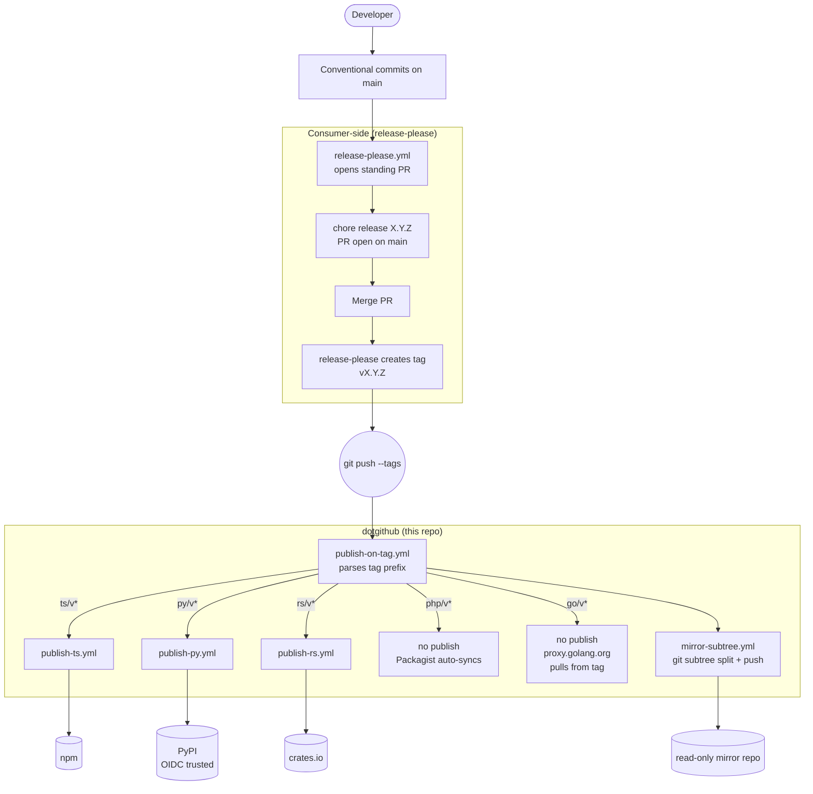
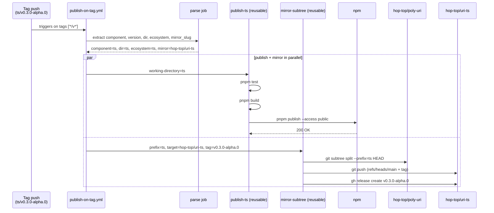
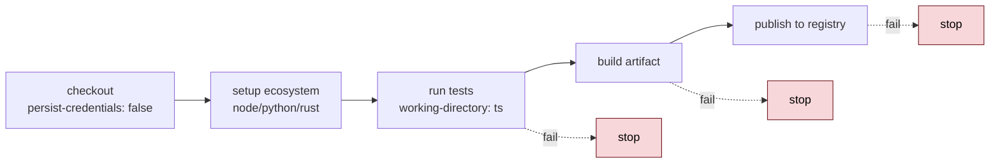
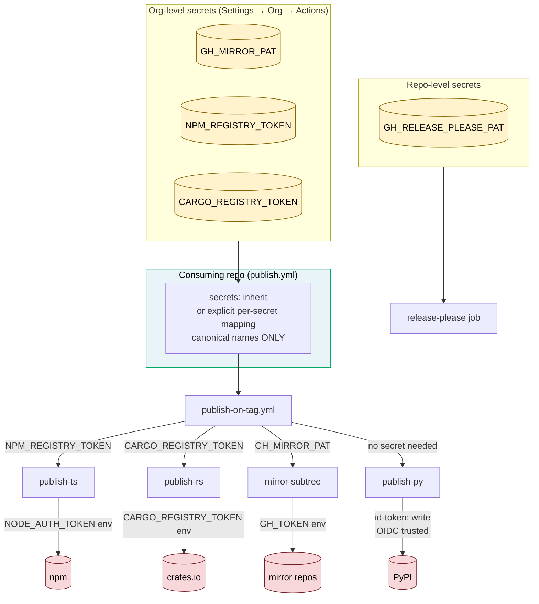

# Architecture

Control and data flow for hop-top's publish/mirror layer.

Diagrams are inline mermaid blocks that GitHub renders natively. The
same diagram sources also exist as standalone `.mmd` files under
[`docs/diagrams/`](diagrams/) for use outside GitHub.

## Scope

This repo owns "**from tag to published package**":

- Parse `<component>/v<version>` tag pushes
- Dispatch to ecosystem-specific publish workflows
- Push subtree splits to read-only mirror repos

It does NOT own "**from commit to tag**" — that's release-please's
job, configured per-consumer.

## Single pipeline, single entry point

The pipeline runs on tag-push only. Whether the tag was created by
release-please merging a stable release or a prerelease (alpha/beta/rc)
makes no difference here — same path either way.

Source: [`diagrams/release-flow.mmd`](diagrams/release-flow.mmd)

## Tag push routing

The router parses any `<component>/v<version>` tag and dispatches to
the right ecosystem workflow plus the mirror. **The mirror always
runs**; the publish job runs only if the ecosystem requires one (php
and go skip — Packagist auto-syncs, go module proxy pulls from tags).

Source: [`diagrams/router-dispatch.mmd`](diagrams/router-dispatch.mmd)

## Control flow within a publish job

Each per-ecosystem reusable workflow follows the same shape.

Source: [`diagrams/publish-job.mmd`](diagrams/publish-job.mmd)

**Fail-fast.** Any step's failure halts the job. The mirror job has
`if: always() && needs.publish-*.result != 'failure'` so a publish
failure also blocks the mirror push.

## Secret flow

Reusable workflows declare what they expect; callers map explicitly
(no fallback chains). Canonical secret names follow
`<NAMESPACE>_<PURPOSE>_<TYPE>`.

Source: [`diagrams/secret-flow.mmd`](diagrams/secret-flow.mmd)

**PyPI uses OIDC, not a secret.** The trusted-publisher config lives
on PyPI's side; the workflow proves identity via `id-token: write`.

## Why this shape

| Decision | Alternative considered | Why we chose this |
|---|---|---|
| Tag push as single trigger | Workflow dispatch / release-please outputs only | One trigger, one pipeline. release-please-created tags AND any other tag (manual, scripted) hit the same path. |
| Org-default repo for reusable workflows | Per-repo workflow duplication | N consumer repos; fixes propagate via `@v1` pin instead of N repo PRs |
| Don't manage versions here | Bundle release-please into dotgithub | release-please is per-repo by design (manifest, config). The PR-opening workflow stays per-consumer; only the publish side is shared. |
| `persist-credentials: false` | Custom token reset step | Cleanest idiomatic fix; documented in `actions/checkout` README. Without it, runner extraheader silently overrides PAT-based pushes. |
| One workflow per ecosystem | Monolithic `publish.yml` with conditionals | Per-ecosystem keeps each file small and lintable; conditionals in YAML are hard to follow |
| Inline mermaid in docs | Pre-rendered PNGs | GitHub renders mermaid natively. No render pipeline, no cross-platform PNG drift, no CI Chrome dependency. |
